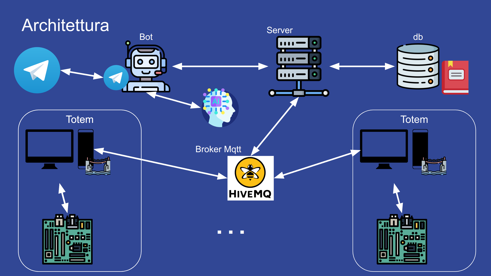
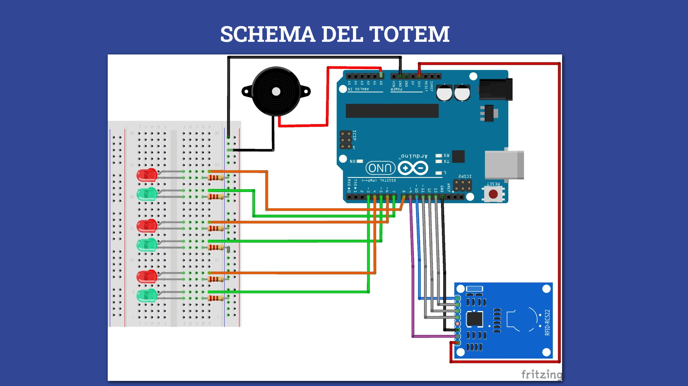
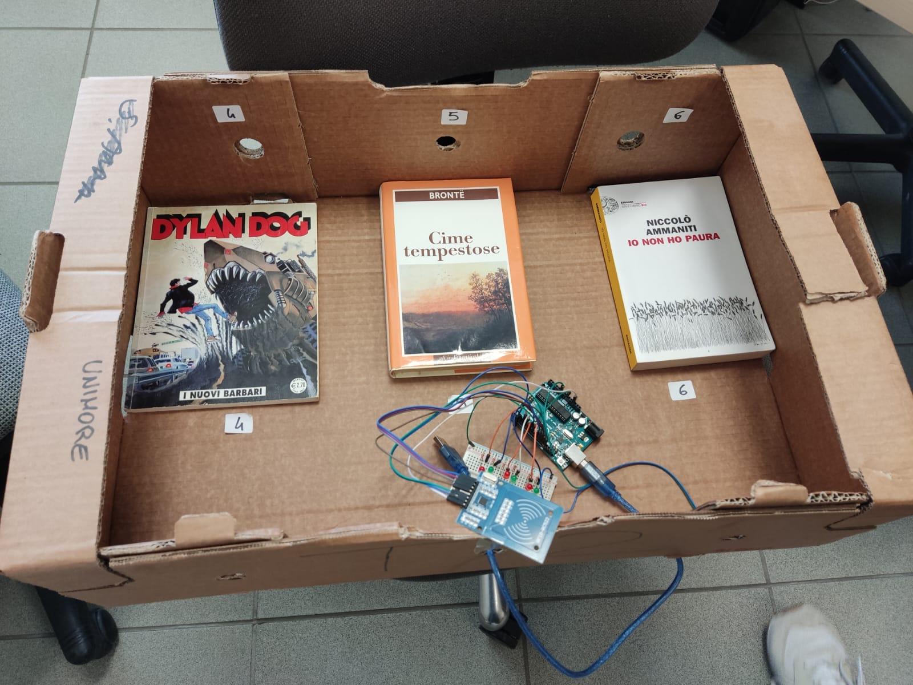

# SMART LIBRARY IOT

Smart Library è l’evoluzione del concetto di biblioteca, è un sistema distribuito che 
consente la gestione completamente autonoma e delocalizzata dei prestiti di libri.

Si tratta di una biblioteca distribuita geograficamente attraversi vari totem automatizzati.

